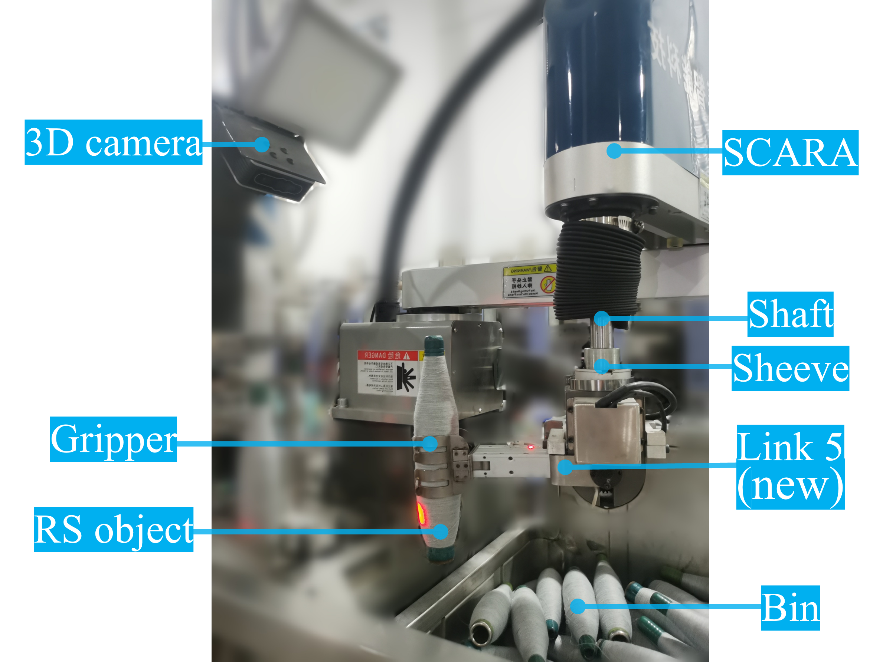

## SCARA+ System: Bin Picking System Of Revolution-Symmetry Objects
Jin, G., Yu, X., Chen, Y., Li, J. (2023), SCARA+ System: Bin Picking System Of Revolution-Symmetry Objects, submitted to IEEE Trans. Ind. Electron.

## Overview
Inspired by the fact that the DoF (degree of freedom) of the RS (revolution-symmetry) pose is exactly the same as adding one DoF to SCARA, we develop a SCARA+ configuration of a SCARA with an additional revolute joint, and explore the possibility of integrating it with a 3D camera to achieve the bin picking of RS objects. To this end, we first discuss the SCARA+ kinematics with the modified DH (Denavit-Hartenberg) parameters. Then, to calibrate the additional DH and the hand-eye parameters in the kinematics, we construct an axis-point model and provide an iterative solution without singularity. Finally, comprehensive experiments verify the superiority of the SCARA+ system. When compared to the state-of-the-art systems, our system achieves a significant efficiency improvement with relatively lower costs. It has also been successfully applied in the spinning industry for practical bobbin loading. This repository mainly contains the codes for simulations and experiments in the article.



**_Figure_**: Configuration of SCARA+ system.


## Usage
### Setups
MATLAB R2020a without any dependencies.

### Main Instruction
To run the single-marker calibration, call
```
[Rcf,tcf,pcf,Rit,tit,pit,rnticf,rntiit] = Alg(Ri,ti,ppi)
```
where
* ``Ri`` (3x3xn): the rotation matrix of robot pose (n is the measurement number),
* ``ti`` (3xn): the translation vector of robot pose,
* ``ppi`` (3xnxm): the 3D observation of a marker (m is the marker number),

* ``Rcf`` (3x3): the rotation matrix of the hand-eye parameter of closed-form solution,
* ``tcf`` (3x1): the translation vector of the hand-eye parameter of closed-form solution (unit: mm),
* ``pcf`` (3mx1): the marker position of closed-form solution (unit: mm), 
* ``rnticf`` (1x1):  the runtime of closed-form solution (unit: seconds),
* ``Rit`` (3x3): the rotation matrix of the hand-eye parameter of iterative solution,
* ``tit`` (3x1): the translation vector of the hand-eye parameter of iterative solution (unit: mm),
* ``pit`` (3mx1): the marker position of iterative solution (unit: mm), 
* ``rnticf`` (1x1):  the runtime of closed-form solution of iterative solution (unit: seconds).


### Simulations

Demo ``mainSingle`` contains the calibration and evaluation of single-marker methods. run ``mainSingle.m``, and the results for eye-in-hand calibration are as follows
```
Measurement number:30
 
Calibration results of the closed-form solution:
Euler angles(degree):-39.3942,-2.9623,-62.7325
translation (mm):-44.9947,6.2389,57.2844
marker position(mm):6.1064,-482.1404,10.277
RMSE(mm):1.7213
Runtime(s):0.0010371
--------------------------------------------------------------------
 
Calibration results of the iterative solution:
Euler angles(degree):-39.6224,-2.9328,-62.7816
translation (mm):-46.4082,7.5472,57.6744
marker position(mm):6.1807,-482.1297,10.2421
RMSE(mm):1.6757
Runtime(s):0.0014392
--------------------------------------------------------------------
Measurement number:50
 
Calibration results of the closed-form solution:
Euler angles(degree):-39.3794,-3.0738,-62.7562
translation (mm):-44.3712,7.3289,57.5741
marker position(mm):6.6562,-481.7926,9.1926
RMSE(mm):2.0093
Runtime(s):0.0045665
--------------------------------------------------------------------
 
Calibration results of the iterative solution:
Euler angles(degree):-39.6185,-3.049,-62.7731
translation (mm):-45.6604,8.666,57.8175
marker position(mm):6.5507,-481.832,9.0897
RMSE(mm):1.9666
Runtime(s):0.0059281
--------------------------------------------------------------------
Measurement number:70
 
Calibration results of the closed-form solution:
Euler angles(degree):-39.4001,-3.1151,-62.8463
translation (mm):-43.8228,7.8471,58.3511
marker position(mm):6.6675,-481.3842,8.3375
RMSE(mm):1.9946
Runtime(s):0.0008625
--------------------------------------------------------------------
```

### Experiments

Demo ``mainSingle`` contains the calibration and evaluation of single-marker methods. run ``mainSingle.m``, and the results for eye-in-hand calibration are as follows


## Video
Video record for the  calibration and pick-up is on http://youtu.be/aI9nByyTc4Y.


**_Figure_**: The calibration configuration.


**_Figure_**: Snaps of three trials for bobbin picking using SCARA+ system.

## Contact
Gumin Jin, Department of Automation, Shanghai Jiao Tong University, Shanghai, jingumin@sjtu.edu.cn
